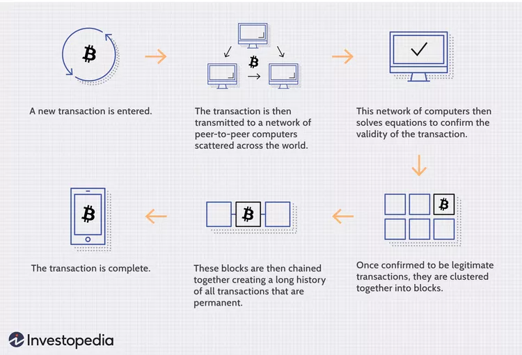

- [ ] What is bitcoin
- [x] What is proof of work
- [x] What is proof of stack
- [x] What is Ethereum
- [x] What is Ethereum layer 2
- [x] What is airdrop
- [x] What is Defi
- [x] What is liquidity
- [ ] What is mining
- [ ] What is miner
- [ ] What is 

# Prerequisites

## Cryptography

Cryptography is a technique to secure information and communication by
using a set of rule-based calculations called algorithms and some
mathematical concepts so only the right person can understand it .
There are three fundamental types of Cryptography: **Symmetric Key
Cryptography**, **Asymmetric Key Cryptography**, and **Hash Function**
. 

**Symmetric Key Cryptography** is an encryption technique that relies on
a single secret key for both encrypting and decrypting data . It is
also referred to as Single Key Encryption . 

**Asymmetric Key Cryptography** is an encryption technique that uses two
keys, a public key and a private key, for encrypting and decrypting data
. The public key is used for encrypting data, while the private key is
used for decrypting data . 

**Hash Function** is a technique that takes an input (or 'message') and
returns a fixed-size string of characters, which is typically a
hexadecimal string . Hash functions are used to verify the integrity of
data by detecting any changes to the original data . They are also used
to store passwords securely .

# What Is a Blockchain? 

A blockchain is a distributed database or ledger
shared among a network of computers. It is known for its role in
maintaining secure and decentralized records of transactions in
cryptocurrency systems. However, blockchains can be used beyond
cryptocurrencies and are capable of making data in any industry
immutable.

## KEY TAKEAWAYS

- Blockchain is a type of shared database that differs from a typical
	database in the way it stores information; blockchains store data in
	blocks linked together via cryptography.
- Different types of information can be stored on a blockchain, but the
	most common use for transactions has been as a ledger. 
- In Bitcoin’s case, blockchain is decentralized so that no single
	person or group has control—instead, all users collectively retain
	control.
- Decentralized blockchains are immutable, which means that the data
	entered is irreversible. For Bitcoin, transactions are permanently
	recorded and viewable to anyone.

# How Does a Blockchain Work? 

Unlike traditional databases, a blockchain's
data is structured and accessed differently. It consists of programs
called scripts that enter and store information in blocks. These blocks
are linked together through encryption algorithms, creating a chain of
blocks. Transactions on a blockchain go through a specific process,
involving validation by miners or validators.

## Transaction Process

Transaction Process: 
Transactions on a blockchain follow a specific process. When initiating
a transaction on Bitcoin's blockchain, it enters a memory pool and waits
to be picked up by a miner or validator.

Mining Process: 
Once a transaction is added to a block along with other transactions,
the block is closed and encrypted using an encryption algorithm. Miners
in the network simultaneously try to solve a hash, generating a random
hash combined with a nonce (a number used once). Miners increment the
nonce until a valid hash is found, winning the race and receiving the
reward.

Confirmation and Block Validation: 
After a block is closed, the transaction is considered complete.
However, confirmation requires validation from five additional blocks.
This process takes approximately one hour in the Bitcoin network, as
each block takes around 10 minutes to be added.

Different Blockchain Processes: 
Not all blockchains follow the exact process described. For example,
Ethereum randomly selects one validator from users with staked ether to
validate blocks, which are then confirmed by the network. This process
is faster and consumes less energy compared to Bitcoin.

> **Fast Fact:**
>
> Generating random hashes until a specific value is found is the
> "proof-of-work" you hear so much about—it "proves" the miner did the
> work. The amount of work it takes to validate the hash is why the
> Bitcoin network consumes so much computational power and energy.

> **Note:**
>
> **Proof of Work (PoW):**
> Definition: Proof of Work is a consensus algorithm used in blockchain
> networks to confirm transactions and produce new blocks in a
> decentralized manner. How it works: Participants in the network, known
> as miners, solve complex mathematical problems to validate and add new
> transactions to the blockchain. The first miner to solve the problem
> gets the right to add a new block to the chain and is rewarded with
> cryptocurrency. Key feature: PoW is resource-intensive, requiring miners
> to invest in powerful hardware and consume a significant amount of
> energy.
> 
> **Proof of Stake (PoS):**
> Definition: Proof of Stake is an alternative consensus algorithm to PoW,
> designed to address some of its drawbacks, especially the environmental
> impact and resource consumption. How it works: Validators are chosen to
> create new blocks and validate transactions based on the amount of
> cryptocurrency they hold and are willing to "stake" as collateral. The
> higher the stake, the higher the chances of being chosen to validate a
> block. Validators are rewarded with transaction fees rather than newly
> created cryptocurrency. Key feature: PoS is considered more
> energy-efficient compared to PoW, as it doesn't require the same level
> of computational work.
> 
> These consensus algorithms play a crucial role in maintaining the
> integrity and security of blockchain networks. While PoW is the original
> and still widely used (as in Bitcoin), PoS and other consensus
> mechanisms are gaining popularity due to their potential for greater
> efficiency and lower environmental impact.

# Blockchain Decentralization 

Decentralization is a key feature of
blockchain. The data in a blockchain is spread across multiple network
nodes, preventing alteration by any single node. This distribution
ensures data fidelity and security.

# Blockchain Transparency 

The decentralized nature of the Bitcoin
blockchain allows for transparent viewing of transactions. Anyone can
track transactions live by having a personal node or using blockchain
explorers. This transparency enhances accountability and trust in the
system.

# Is Blockchain Secure? 

Blockchain technology offers security through its
decentralized and immutable nature. Once data is entered into a block,
it becomes irreversible. However, it's important to note that individual
implementations of blockchain may vary in terms of their security
measures.

# Blockchain Applications 

Blockchains have found applications beyond
cryptocurrencies. They are used in decentralized finance (DeFi)
applications, non-fungible tokens (NFTs), smart contracts, and various
other industries. Blockchain technology has the potential to
revolutionize sectors such as finance, supply chain management,
healthcare, and more.

> **Note:**
> 
> DeFi stands for Decentralized Finance, and it refers to a set of
> financial services and applications built on blockchain technology. In
> contrast to traditional finance, which relies on centralized authorities
> like banks and governments, DeFi operates in a decentralized manner
> using smart contracts on blockchain platforms, primarily Ethereum.
> 
> Key features of DeFi include:
> 
> * Open and Permissionless: DeFi platforms are open to anyone with an
> 	internet connection, allowing for global accessibility without the
> 	need for traditional intermediaries.
> 
> * Smart Contracts: These are self-executing contracts with the terms of
> 	the agreement directly written into code. Smart contracts automate and
> 	enforce the rules of the financial transactions without the need for
> 	intermediaries.
> 
> * Interoperability: DeFi projects often interact with each other, and
> 	users can use multiple services seamlessly within the decentralized
> 	finance ecosystem.
> 
> * Liquidity Pools: DeFi relies on liquidity provided by users to
> 	facilitate various financial activities like lending, borrowing, and
> 	trading. Users contribute their cryptocurrency to liquidity pools and
> 	earn fees in return.
> 
> Common DeFi applications include:
> 
> * Decentralized Exchanges (DEX): Platforms that allow users to trade
> 	cryptocurrencies without relying on a central authority.
> * Lending and Borrowing Platforms: Users can lend their cryptocurrencies
> 	to earn interest or borrow assets by providing collateral.
> * Stablecoins: Cryptocurrencies pegged to the value of traditional fiat
> 	currencies, providing stability in a volatile market.
> * Automated Market Makers (AMM): These are algorithms that facilitate
> 	decentralized trading, determining prices based on a predefined
> 	formula.
> * Yield Farming: Users can earn rewards by providing liquidity to
> 	certain DeFi protocols.
> 
> While DeFi has gained significant popularity for its potential to
> democratize finance and increase financial inclusion, it also comes with
> risks, such as smart contract vulnerabilities, regulatory uncertainties,
> and market volatility. Users should exercise caution and conduct
> thorough research before participating in DeFi activities.

[bitcoin vs blockchain]

# What is Ethereum

It looks like there's a small typo in your question. I assume you meant "Ethereum." Ethereum is a decentralized, open-source blockchain platform that enables the creation and execution of smart contracts and decentralized applications (DApps). Here are some key features and concepts associated with Ethereum:

1. **Smart Contracts:** Ethereum introduced the concept of smart contracts, which are self-executing contracts with the terms directly written into code. These contracts automatically execute when predefined conditions are met, without the need for intermediaries.

2. **Decentralized Applications (DApps):** Ethereum provides a platform for developers to build decentralized applications. These applications run on a network of computers (nodes) rather than a centralized server.

3. **Ether (ETH):** Ether is the native cryptocurrency of the Ethereum platform. It is used to compensate participants who perform computations and validate transactions on the network. Ether can also be used to pay for transaction fees and participate in various decentralized applications.

4. **Blockchain Technology:** Ethereum utilizes blockchain technology, a distributed ledger that records all transactions across a network of computers. This ledger is maintained by a consensus algorithm, and once a block of transactions is added to the chain, it is difficult to alter, providing security and transparency.

5. **Decentralized Finance (DeFi):** Ethereum has played a significant role in the rise of decentralized finance. Many DeFi applications, including decentralized exchanges, lending platforms, and yield farming projects, are built on the Ethereum blockchain.

6. **Upcoming Upgrades:** Ethereum has undergone several upgrades, with the most notable being Ethereum 2.0. This upgrade aims to improve scalability, security, and sustainability by transitioning from a proof-of-work (PoW) to a proof-of-stake (PoS) consensus mechanism.

Ethereum has had a profound impact on the blockchain and cryptocurrency space, serving as the foundation for a wide range of innovative projects. It has become a crucial platform for developers looking to create decentralized applications and experiment with blockchain technology.

# Ethereum layer 2

Ethereum Layer 2 refers to various solutions built on top of the Ethereum blockchain to address its scalability issues. The main challenge with the Ethereum network is its limited transaction throughput, which can lead to congestion and high gas fees during periods of high demand. Layer 2 solutions aim to alleviate these issues by processing transactions off the main Ethereum chain while still benefiting from its security.

There are different types of Layer 2 solutions, and here are two common categories:

1. **Sidechains:** These are separate blockchains that run in parallel to the Ethereum mainnet but are pegged to it. Transactions can be conducted on the sidechain, and users can move assets between the main chain and the sidechain. Examples include Optimistic Rollups and zk-rollups.

    - **Optimistic Rollups:** These solutions assume that most transactions are valid and only provide a fraud-proof if someone submits an invalid transaction. This optimistic approach speeds up transaction processing but requires a challenge period during which potential fraud can be identified.

    - **zk-rollups (Zero-Knowledge Rollups):** These solutions use zero-knowledge proofs to bundle multiple transactions into a single proof that is submitted to the Ethereum mainnet. This approach provides scalability benefits while maintaining a high level of security.

2. **State Channels:** These are off-chain channels where users can conduct multiple transactions without involving the Ethereum mainnet for each one. State channels enable faster and cheaper transactions, and the final state is then settled on the Ethereum mainnet.

Layer 2 solutions aim to increase the transaction throughput of Ethereum, reduce transaction fees, and improve the overall user experience. They enable developers to build decentralized applications (DApps) with improved scalability without sacrificing the security guarantees provided by the Ethereum mainnet. Adoption of Layer 2 solutions is seen as a crucial step in the evolution of Ethereum and the broader blockchain ecosystem.

Certainly! Here are some key features and aspects of Ethereum Layer 2 solutions:

1. **Scalability:** The primary goal of Layer 2 solutions is to improve the scalability of the Ethereum network. By processing transactions off the main Ethereum chain, these solutions can handle a larger number of transactions per second, reducing congestion and lowering transaction fees.

2. **Reduced Transaction Fees:** Layer 2 solutions aim to provide more cost-effective transactions compared to the main Ethereum chain. By offloading a significant portion of transaction processing to secondary layers, users can experience lower fees and faster confirmation times.

3. **Faster Transaction Confirmations:** Transactions on Layer 2 solutions can be confirmed more quickly than on the main Ethereum chain. This is because these solutions operate with different consensus mechanisms or optimization techniques that allow for faster block generation and finality.

4. **Interoperability:** Layer 2 solutions are designed to be interoperable with the main Ethereum chain, allowing users to move assets seamlessly between the mainnet and Layer 2 environments. This interoperability ensures that users can access the benefits of Layer 2 while still having a connection to the security of the Ethereum mainnet.

5. **Security:** While transactions are processed off-chain or on secondary blockchains, Layer 2 solutions maintain a strong connection to the security of the Ethereum mainnet. Various mechanisms, such as cryptographic proofs or periodic settlements, ensure the integrity and security of Layer 2 transactions.

6. **User Experience:** Layer 2 solutions aim to enhance the overall user experience by providing faster and more cost-effective transactions. This is crucial for the adoption of decentralized applications (DApps) and other services built on the Ethereum platform.

7. **Compatibility with Smart Contracts:** Layer 2 solutions are designed to be compatible with existing Ethereum smart contracts. Developers can leverage their existing codebase when deploying applications on Layer 2, making it easier to migrate or extend their projects.

8. **Ethereum 2.0 Integration:** Some Layer 2 solutions are designed to complement the Ethereum 2.0 upgrade. Ethereum 2.0 aims to transition the network from a proof-of-work (PoW) to a proof-of-stake (PoS) consensus mechanism, and Layer 2 solutions can work in conjunction with these changes to further improve scalability and efficiency.

Overall, Ethereum Layer 2 solutions play a crucial role in addressing the scalability challenges of the Ethereum network, offering improved performance and cost efficiency for users and developers. As the blockchain ecosystem evolves, Layer 2 solutions are expected to become increasingly important in facilitating mainstream adoption of decentralized applications and services.

# What is airdrop

An airdrop in the context of cryptocurrencies and blockchain refers to the distribution of free tokens or coins to a specific group of wallet addresses as a way to promote a new project, increase awareness, or reward existing users. Essentially, it involves the "dropping" or distribution of tokens to the community for free or in exchange for simple tasks.

Here are some key points about airdrops:

1. **Distribution Method:** Airdrops can be distributed in various ways. Some common methods include direct transfers to existing wallet addresses, requiring users to complete specific tasks (such as following social media accounts or joining a Telegram group), or distributing tokens to holders of a particular cryptocurrency.

2. **Promotion and Marketing:** Airdrops are often used as a marketing strategy to generate interest and awareness for a new cryptocurrency or blockchain project. By distributing tokens for free, projects can quickly build a community and attract users.

3. **Community Building:** Airdrops can help build a strong and engaged community around a project. Participants who receive free tokens may become interested in the project, its development, and its long-term success.

4. **Token Utility:** Airdropped tokens may have various utilities within the project's ecosystem. For example, they could be used for governance, accessing specific features or services, or as a form of value transfer within the platform.

5. **Snapshot Airdrops:** Some airdrops are based on a snapshot of existing blockchain holdings. If you hold a certain cryptocurrency at a specific block height (snapshot point), you may be eligible to receive a certain amount of the new airdropped tokens.

6. **Compliance and Regulations:** It's important to note that the regulatory environment around airdrops varies, and compliance with local regulations is crucial. In some jurisdictions, airdrops may be subject to securities laws, and projects may need to take steps to ensure legal compliance.

7. **Risk and Scams:** While legitimate projects use airdrops as a marketing tool, there are also scams and fraudulent airdrops. Participants should exercise caution and verify the legitimacy of airdrop campaigns to avoid falling victim to scams.

Airdrops have become a common practice in the cryptocurrency space and are often used to bootstrap a project's community, distribute tokens fairly, and incentivize user engagement. Users interested in participating in airdrops should carefully review the terms and conditions of each campaign and be cautious of potential risks.

Certainly, let's dive a bit deeper into the concept of airdrops in the context of cryptocurrencies:

1. **Types of Airdrops:**
   - **Classic Airdrop:** In a classic airdrop, tokens are distributed freely to the wallets of existing cryptocurrency holders. This could involve holders of a specific cryptocurrency (like Bitcoin or Ethereum) receiving a certain amount of a new token based on their holdings at a particular snapshot in time.
   
   - **Task-Based Airdrop:** Some projects require participants to complete specific tasks to be eligible for the airdrop. Tasks may include joining a Telegram group, following social media accounts, or completing a simple form. These tasks are designed to increase awareness and engagement with the project.

   - **Holder Airdrop:** This type of airdrop rewards existing holders of a particular cryptocurrency with free tokens. The distribution is often proportional to the amount of the cryptocurrency held.

   - **Community Airdrop:** Projects may distribute tokens to members of their community or user base as a way to thank them for their support. This can foster a sense of loyalty and community engagement.

2. **Purpose of Airdrops:**
   - **Promotion and Marketing:** Airdrops are a popular marketing strategy to create awareness and interest in a new cryptocurrency project. By distributing free tokens, projects can quickly attract attention and build a community around their platform.

   - **Community Building:** Airdrops can help projects build a strong and engaged community. Participants who receive free tokens may become interested in the project's development and success, contributing to its long-term viability.

   - **Token Distribution:** Airdrops can be a fair and decentralized way to distribute tokens. Instead of relying solely on initial coin offerings (ICOs) or token sales, projects can distribute tokens more widely and involve a larger number of users from the start.

   - **Incentivizing Usage:** Some projects use airdrops to encourage users to try out their platform or services. By distributing tokens that have utility within the project's ecosystem, developers can incentivize users to explore and use their platform.

3. **Risks and Considerations:**
   - **Scams:** The popularity of airdrops has led to an increase in scams. Participants should be cautious and verify the legitimacy of airdrop campaigns. Legitimate projects usually provide clear information about the airdrop, its purpose, and the team behind it.

   - **Regulatory Compliance:** The regulatory environment for airdrops is evolving, and projects need to be mindful of compliance with local regulations. In some cases, airdrops may be subject to securities laws, and projects may need legal guidance.

   - **Wallet Security:** Participants need to ensure the security of their wallets when participating in airdrops. Scammers may try to exploit individuals by posing as airdrop organizers or distributing fake airdrop links.

In summary, airdrops are a distribution method used by cryptocurrency projects to distribute free tokens, promote their platforms, and build communities. While they can be an exciting way for users to get involved with new projects, participants should exercise caution and conduct due diligence to avoid potential scams or security risks.

# Airdrop vs Swap vs Liquidity

1. **Airdrop:**
   - An airdrop refers to the distribution of free tokens or cryptocurrencies to a specific group of addresses. Airdrops are often used as a marketing strategy by blockchain projects to raise awareness, reward users, or encourage participation in their ecosystem.
   - Participants in an airdrop might receive free tokens simply for holding a certain cryptocurrency, being part of a specific community, or completing tasks like joining social media channels or referring others to the project.
   - Airdrops can take different forms, including traditional airdrops where tokens are sent directly to users' wallets, or liquidity pool airdrops where users are rewarded for providing liquidity to a decentralized finance (DeFi) protocol.

2. **Swap:**
   - A swap, in the context of cryptocurrencies, refers to the exchange of one cryptocurrency for another. This exchange can take place on various platforms, including centralized exchanges (CEX) or decentralized exchanges (DEX).
   - On a centralized exchange, users typically trade on a platform that acts as an intermediary, matching buy and sell orders. On a decentralized exchange, users trade directly from their wallets without the need for an intermediary.
   - The term "swap" is often used in the context of decentralized finance (DeFi), where users can swap one cryptocurrency for another directly on blockchain platforms using smart contracts.

3. **Liquidity:**
   - Liquidity, in the context of financial markets and cryptocurrencies, refers to the ease with which an asset can be bought or sold without causing a significant impact on its price. Liquid assets are easily tradable, while illiquid assets may experience larger price swings with each trade.
   - In the context of decentralized finance (DeFi), liquidity is often associated with liquidity pools. Users can contribute their cryptocurrencies to these pools, providing the necessary funds for decentralized exchanges or lending platforms. Liquidity providers are usually rewarded with fees or tokens for contributing to the liquidity pool.
   - Liquidity is a crucial factor in determining the efficiency and functionality of markets. High liquidity contributes to lower trading costs, tighter bid-ask spreads, and a more stable market environment.

In summary, an airdrop involves the free distribution of tokens, a swap refers to the exchange of one cryptocurrency for another, and liquidity is the ease with which assets can be bought or sold in the market. These concepts are integral to the cryptocurrency and blockchain space, especially in the context of decentralized finance and community engagement.

# Smart contract

A smart contract is a self-executing contract with the terms of the agreement directly written into code. It operates on a blockchain, and its execution is automated when predetermined conditions are met. Smart contracts enable trustless and secure execution of agreements without the need for intermediaries.

Key features of smart contracts include:

1. **Automation:** Smart contracts automate the execution of contractual terms. When predefined conditions, often referred to as "if-then" statements, are met, the contract automatically executes without the need for manual intervention.

2. **Decentralization:** Smart contracts run on blockchain networks, which are decentralized and distributed across a network of computers (nodes). This ensures that no single entity has control over the contract, enhancing security and reducing the risk of manipulation.

3. **Transparency:** The code and terms of a smart contract are typically visible on the blockchain, providing transparency to all parties involved. Participants can verify the terms and the execution of the contract.

4. **Trustlessness:** Smart contracts eliminate the need for trust between parties. The code enforces the terms, and the outcome is predetermined, reducing the risk of fraud or manipulation.

5. **Security:** Blockchain technology provides a secure environment for smart contracts. Once a smart contract is deployed on the blockchain, it becomes resistant to tampering or unauthorized changes.

6. **Immutable:** Once deployed on the blockchain, smart contracts are usually immutable, meaning they cannot be altered or tampered with. This immutability ensures that the agreed-upon terms remain unchanged.

7. **Use Cases:**
   - **Financial Transactions:** Smart contracts are widely used for financial transactions, such as transferring digital assets or executing complex financial agreements.
   - **Supply Chain Management:** Smart contracts can automate and secure various stages of supply chain processes, ensuring transparency and efficiency.
   - **Token Sales (ICOs, STOs):** Many initial coin offerings (ICOs) and security token offerings (STOs) use smart contracts to manage the distribution of tokens and the execution of investment agreements.
   - **Insurance:** Smart contracts can automate insurance claims and payouts based on predefined conditions, reducing the need for intermediaries.

8. **Programming Languages:** Smart contracts are typically written in specific programming languages designed for blockchain platforms. For example, Ethereum uses languages like Solidity, while other blockchain platforms may have their own languages.

9. **Ethereum and Smart Contracts:** Ethereum is a popular blockchain platform known for its support of smart contracts. Ethereum's native cryptocurrency, Ether (ETH), is often used to facilitate transactions and deploy smart contracts on the Ethereum blockchain.

The functioning of smart contracts involves several key steps, from creation to execution on a blockchain. Let's break down the process of how smart contracts work:

1. **Creation:**
   - **Coding the Contract:** A smart contract is created by writing code that defines the terms and conditions of the agreement. This code is typically written in a specific programming language suitable for the blockchain platform on which the contract will run (e.g., Solidity for Ethereum).

   - **Deploying to the Blockchain:** Once the code is written, it needs to be deployed to the blockchain. This involves sending a transaction to the blockchain network that includes the compiled code of the smart contract. The contract is assigned a unique address on the blockchain.

2. **Initialization:**
   - **Deployment Parameters:** Smart contracts can be initialized with specific parameters, such as initial values, addresses of involved parties, or any other configuration data. These parameters are included when the contract is deployed.

3. **Blockchain Validation:**
   - **Consensus Mechanism:** The blockchain network, which is maintained by a consensus mechanism (e.g., proof-of-work or proof-of-stake), validates and confirms the deployment of the smart contract. Once confirmed, the contract becomes part of the blockchain's immutable ledger.

4. **Execution:**
   - **Triggering Events:** Smart contracts are designed to execute automatically based on specific triggering events or conditions. These events are predefined in the contract's code and are often structured as "if-then" statements.

   - **Transaction Inputs:** When a triggering event occurs, a participant (or an external system) sends a transaction to the smart contract. The transaction includes the necessary inputs or data required to execute the contract.

   - **Code Execution:** The smart contract's code is executed on the blockchain's nodes. This execution is deterministic, meaning that given the same inputs and conditions, the result will always be the same.

   - **State Changes:** The execution of the smart contract can result in changes to the state of the contract or the blockchain. For example, transferring ownership of a digital asset, updating a record, or triggering a payment.

5. **Consensus Confirmation:**
   - **Validation by Nodes:** The blockchain nodes validate the transaction and the execution of the smart contract according to the rules defined in the blockchain protocol and the contract's code.

   - **Consensus Agreement:** Once the majority of nodes reach a consensus that the transaction and the smart contract execution are valid, the changes are committed to the blockchain. The contract's updated state is now visible to all participants.

6. **Immutability:**
   - **Finality and Immutability:** The result of the smart contract execution becomes part of the immutable blockchain ledger. The contract, its code, and its state are visible and accessible to all participants on the blockchain.

# What is BNB

Binance Coin (BNB) is the native cryptocurrency of the Binance blockchain, which is often referred to as the Binance Chain. Binance Chain is a blockchain platform created by Binance, one of the world's largest cryptocurrency exchanges. BNB serves as the native utility token of both the Binance Chain and the broader Binance ecosystem.

Here are key points about Binance Chain and BNB:

1. **Binance Chain:**
   - Binance Chain is a blockchain platform designed for the issuance and transfer of digital assets. It was launched by Binance in 2019.
   - The primary focus of Binance Chain is to provide fast and low-cost transactions for users, particularly those involved in trading and transferring digital assets.

2. **Binance Coin (BNB):**
   - BNB is the native cryptocurrency of Binance Chain.
   - Originally, BNB was an ERC-20 token on the Ethereum blockchain, but it transitioned to Binance Chain after the platform's launch. BNB can be used to pay for transaction fees on Binance Chain and various other use cases within the Binance ecosystem.

3. **Use Cases of BNB:**
   - **Transaction Fees:** BNB can be used to pay for transaction fees on the Binance Chain. Users who pay fees with BNB may receive discounts.
   - **Token Sales:** BNB is often used as the primary currency for participating in token sales on Binance Launchpad, a platform for launching new blockchain projects.
   - **Binance Smart Chain:** BNB is also used on Binance Smart Chain (BSC), a parallel blockchain to Binance Chain that supports smart contracts. Users can use BNB for transactions and other activities on BSC.

4. **Binance Smart Chain (BSC):**
   - Binance Smart Chain is a blockchain network developed by Binance that runs in parallel with Binance Chain. BSC is designed to support smart contracts and decentralized applications (DApps).
   - It offers compatibility with the Ethereum Virtual Machine (EVM), making it easier for developers to port their Ethereum-based projects to BSC.

5. **Staking and Delegated Proof-of-Stake (DPoS):**
   - Binance Chain uses a Delegated Proof-of-Stake (DPoS) consensus mechanism. Token holders can stake their BNB and participate in the governance and security of the network by voting for validators.

6. **Integration with Binance Exchange:**
   - BNB originated as a utility token for transactions on the Binance cryptocurrency exchange. Over time, it has expanded its use cases within the broader Binance ecosystem, including Binance Chain and Binance Smart Chain.

7. **Community and Ecosystem:**
   - BNB has a vibrant community and is actively used within the Binance ecosystem. Its adoption has been driven by its utility in various applications, including trading, token sales, and governance.

# Arbitrum

As of my last knowledge update in January 2022, Arbitrum refers to a layer 2 scaling solution for Ethereum, specifically designed to improve the scalability and reduce transaction fees on the Ethereum blockchain. It is developed by Offchain Labs.

Here are key points about Arbitrum:

1. **Layer 2 Scaling:**
   - Arbitrum is categorized as a layer 2 scaling solution for Ethereum. Layer 2 solutions aim to address the scalability challenges of the Ethereum network by processing transactions off the main Ethereum blockchain and then periodically anchoring the results back onto the main chain.

2. **Rollups:**
   - Arbitrum utilizes a specific type of layer 2 solution called Optimistic Rollup. In a Rollup, transactions are processed off-chain, and only the essential data is submitted to the Ethereum main chain. This allows for increased transaction throughput without compromising security.

3. **Reduced Transaction Fees:**
   - One of the primary goals of Arbitrum is to reduce transaction fees on the Ethereum network. By processing a significant portion of transactions off-chain, users can experience lower fees and faster transaction confirmation times.

4. **Compatibility with Ethereum:**
   - Applications and smart contracts developed for the Ethereum blockchain can potentially be deployed on Arbitrum with minimal modifications. This compatibility is essential for seamless migration and interoperability.

5. **Optimistic Rollup Mechanism:**
   - In an Optimistic Rollup, transactions are initially processed off-chain in a more flexible and optimistic environment. A cryptographic technique called fraud proofs is used to challenge and prove any misbehavior on the part of participants, ensuring the security of the system.

6. **EVM Compatibility:**
   - Arbitrum is designed to be compatible with the Ethereum Virtual Machine (EVM), allowing developers to use existing Ethereum tools and infrastructure for building and deploying smart contracts.

7. **User Experience:**
   - Users interacting with applications on Arbitrum may experience faster confirmation times and lower fees compared to transactions on the Ethereum main chain.

# Optimism

The Optimistic Ethereum (Optimism) project, which is a layer 2 scaling solution for the Ethereum blockchain. It aims to improve the scalability and reduce transaction fees on the Ethereum network. Here are key points about Optimism:

1. **Layer 2 Scaling Solution:**
   - Optimism is a layer 2 scaling solution designed to address the scalability challenges of the Ethereum network. It falls under the category of Optimistic Rollups, a specific type of layer 2 solution.

2. **Rollup Mechanism:**
   - In Optimistic Rollups, transactions are processed off-chain in a more flexible and optimistic environment. Only essential information, such as transaction data and state changes, is periodically anchored back onto the Ethereum main chain.

3. **Reduced Transaction Fees and Faster Confirmations:**
   - One of the primary goals of Optimism is to reduce transaction fees on the Ethereum network and improve confirmation times. By offloading a significant portion of transactions to layer 2, users can experience lower fees and faster transaction processing.

4. **Compatibility with Ethereum:**
   - Optimism is designed to be compatible with the Ethereum Virtual Machine (EVM), allowing for easy migration of applications and smart contracts from the Ethereum main chain to the Optimistic Ethereum network.

5. **Optimistic Rollup Security:**
   - The security of the Optimistic Ethereum network relies on the concept of optimistic execution. Transactions are initially processed off-chain optimistically, and participants have the opportunity to submit fraud proofs in case of misbehavior, ensuring the security of the system.

6. **Integration with DeFi and DApps:**
   - Optimism is particularly relevant in the context of decentralized finance (DeFi) and decentralized applications (DApps) on Ethereum. Many DeFi projects and applications are exploring or implementing layer 2 scaling solutions to enhance user experience and reduce costs.

# Polygon

Polygon is a framework for building and connecting Ethereum-compatible blockchain networks. Formerly known as Matic Network, Polygon aims to provide solutions to scalability and usability issues on the Ethereum blockchain. Here are key points about Polygon:

1. **Scalability Solution:**
   - Polygon is designed as a layer 2 scaling solution for Ethereum, offering a set of tools and frameworks to create sidechains that are interoperable with the Ethereum main chain.

2. **Interoperability:**
   - Polygon is known for its commitment to interoperability. It allows for easy transfer of assets and information between various blockchains, including the Ethereum main chain and other networks built using the Polygon framework.

3. **Polygon PoS (Proof of Stake) Chain:**
   - The Polygon PoS chain is one of the core components of the Polygon network. It operates as a proof-of-stake blockchain, aiming to achieve faster transaction confirmations and lower fees compared to the Ethereum main chain.

4. **Ethereum Compatibility:**
   - Applications and smart contracts developed for the Ethereum blockchain can be deployed on the Polygon network with minimal modifications. This compatibility simplifies the migration process for developers.

5. **Polygon SDK (Software Development Kit):**
   - The Polygon SDK provides developers with a set of tools to create custom blockchain networks that are compatible with Ethereum. It allows developers to choose the consensus mechanism and other parameters for their blockchain.

6. **Polygon PoS Bridge:**
   - The Polygon PoS Bridge facilitates the movement of assets between the Ethereum main chain and the Polygon PoS chain. This bridge enables users to transfer tokens seamlessly between the two chains.

7. **Use Cases:**
   - Polygon is particularly popular for decentralized finance (DeFi) projects, non-fungible tokens (NFTs), and various decentralized applications (DApps) looking to leverage its scalability and cost-effectiveness.

8. **Community and Governance:**
   - Polygon has an active and engaged community. The project has introduced a governance system that allows token holders to participate in decision-making processes related to the network's development and upgrades.

9. **MATIC Token:**
   - MATIC is the native utility token of the Polygon network. It is used for various purposes, including paying transaction fees, participating in governance, and staking to secure the network.

# Related

* https://www.investopedia.com/terms/b/blockchain.asp
